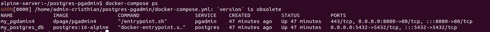
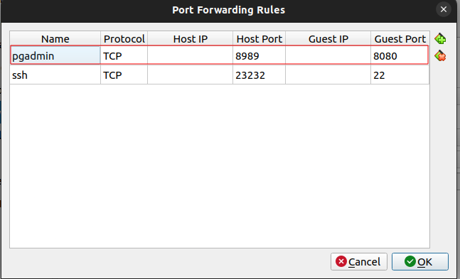
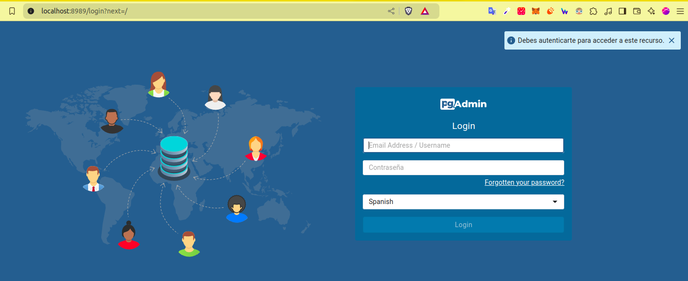

Autor: Cristhian Fernando Moreno Manrique

Objetivo: Implementar cliente phpMyadmin conectado con Base de datos MariaDb utilizando docker compose

# Configuración del docker-compose.yml

```yml
version: '3.8'

services:
  postgres:
    image: postgres:16-alpine
    container_name: my_postgres_db
    environment:
      POSTGRES_USER: ${POSTGRES_USER}
      POSTGRES_PASSWORD: ${POSTGRES_PASSWORD}
      POSTGRES_DB: ${POSTGRES_DB}
    volumes:
      - postgres_data:/var/lib/postgresql/data
    ports:
      - "5432:5432"
    networks:
      - postgres-network
  pgadmin:
    image: dpage/pgadmin4
    container_name: my_pgdamin4
    ports:
      - "8080:80"
    volumes:
      - pgadmin-data:/var/lib/pgadmin
    environment:
      PGADMIN_DEFAULT_EMAIL: ${PGADMIN_DEFAULT_EMAIL}
      PGADMIN_DEFAULT_PASSWORD: ${PGADMIN_DEFAULT_PASSWORD}
    env_file:
      - .env
    networks:
      - postgres-network

volumes:
  postgres_data:
  pgadmin-data:

networks:
  postgres-network:
```
Para definir las variables de entorno haga una copia del archivo .env.template y asigne valores a cada una de las variables.

Para esta configuración se utilizaron las siguientes variables de entorno:
- POSTGRES_USER: Esta variable de entorno nos sirve para ....
- POSTGRES_PASSWORD

Se configuro la red postgres-network para conectar los sevicios de postgres y pgadmin.

volumenes
puertos.
se agrego el parametro env_file para leer las variables de entorno del archivo .env.

# Como implementar el proyecto
ejecute el siguiente comando para implementar los servicios
```shell
docker-compose up -d
```

verifique que los contenedores esten en ejecucion
```
docker-compose ps
```


# conexión con el cliente
Si esta en virtualbox, puede configurar el reenvio de puertos de la siguiente manera:



detalles de la imagen...

abrir el navegador en el puerto configurado e inicie sesión.



... 
...
...

realice la conexión al servidor de la siguiente manera